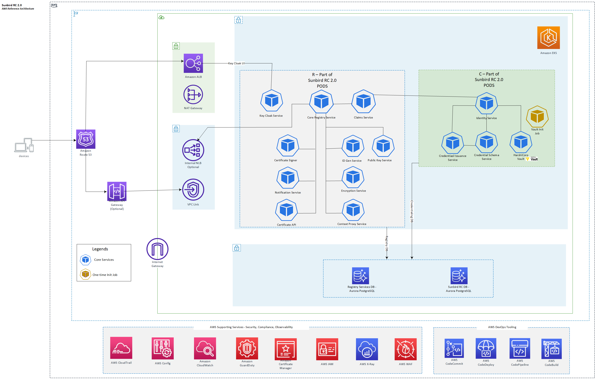

# Sunbird RC 2.0, one-click deployment on AWS

### Description
Sunbird RC 2.0 is an interoperable and unified registry infrastructure that needs to be established to enable "live," "reusable," and "trustworthy" registries as a "single source of truth" to address the three core issues mentioned.

**Sunbird-RC has two core components:**
[Registry](https://rc.sunbird.org/learn/technical-overview/registry/high-level-architecture)
[Credentialling](https://rc.sunbird.org/learn/technical-overview/credentialling/high-level-architecture)

To learn more about Sunbird RC, please visit [SunbirdRC 2.0](https://docs.sunbirdrc.dev/).

### Packaging overview
This packaging initiative offers a practical approach to increase the adoption, streamline deployment and management of Sunbird RC 2.0 building blocks on AWS by providing a reference architecture and one-click deployment automation scripts. It allows builders to manage AWS resource provisioning and application deployment in a programmatic and repeatable way.

This repository contains the source code and configuration for deploying Sunbird RC 2.0 stack that leverages the power of Amazon Web Services (AWS) **[Cloud Development Kit (CDK)](https://aws.amazon.com/cdk)** for infrastructure provisioning and **[Helm](https://helm.sh)** for deploying services within an Amazon Elastic Kubernetes Service (EKS) cluster.  

### Sunbird RC 2.0 Deployment
The Sunbird RC 2.0 one-click deployment packaging offers two mode of deployments on the AWS cloud, catering to different deployment scenarios.

#### Mode One: AWS CDK + Helm
This mode offers a comprehensive solution for users who prefer a one-click deployment approach to provisioning AWS infrastructure and deploying the Sunbird RC 2.0 application stack.

* [AWS CDK One Click Deployment](documentation/01-Deployment-CDK-Sunbirdrc2.md)

#### Mode Two: Direct Helm Chart Invocation
An alternative deployment approach accommodates users with existing essential AWS infrastructure components like Amazon RDS Postgres and an Amazon EKS cluster. This mode enables the direct installation of the Sunbird RC 2.0 Helm chart without relying on AWS CDK scripts. Alternatively, you can combine both methods, utilizing CDK for provisioning specific services like the EKS cluster.

* [Helm Chart Deployment](documentation/02-Deployment-Helm-Sunbirdrc2.md)

### Sunbird RC 2.0 reference architecture
Required AWS services to operate the core Sunbird RC 2.0 registry and credentialling services:
* Amazon VPC
* Amazon RDS for PostgreSQL
* Amazon Elastic Kubernetes Service (Amazon EKS)
* Elastic Load Balancing (ELB)

