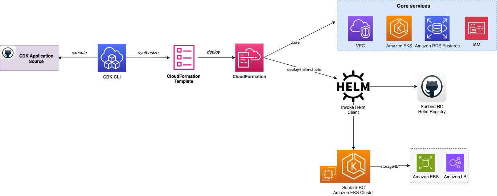

## AWS CDK One Click Deployment ##

## Prerequisites

- **AWS Account**: An AWS account to deploy AWS CDK stacks
- **[AWS CLI](https://docs.aws.amazon.com/cli/latest/userguide/getting-started-install.html)**: Configured with AWS account
- **Amazon EC2 bastion host**: For accessing a [private only Amazon EKS API](https://docs.aws.amazon.com/eks/latest/userguide/cluster-endpoint.html) server.
- **Kubectl Client**: Configured on Amazon EC2 bastion host with the Amazon EKS cluster. 
- **Public Domain/Sub-Domain**: Along with SSL certificates for HTTPS.





### Public Domain/sub-domain

Sunbird RC requires a public domain to be associated with `Registry` service.

Users must obtain a public domain and/or create subdomains in an existing domain. Additionally, an SSL certificate must be issued for subdomain to enable HTTPS for `Registry` service. You can use [AWS Certificate Manager](https://aws.amazon.com/certificate-manager/pricing/), which provides public SSL/TLS certificates at no cost.

### Requesting a Public SSL Certificate through AWS Certificate Manager

To obtain an SSL certificate through AWS Certificate Manager, follow the easy steps provided in the official [AWS ACM Documentation](https://docs.aws.amazon.com/acm/latest/userguide/gs-acm-request-public.html).

Once a certificate is issued for your subdomain, copy the certificate ARN to be used in the environment variable later. The certificate ARN follows this format:

`arn:aws:acm:ap-south-1:<aws-account-id>:certificate/<identifier>`

## AWS CDK Stack Overview
The CDK comprises stacks designed to perform unique provisioning steps, making the overall automation modular. Here is an overview of all the stacks along with the actions they perform:

| CDK Stack name           | File name/path           | Description                                                                                       |
|--------------------------|--------------------------|---------------------------------------------------------------------------------------------------|
| -                        | bin/sunbirdrc2-cdk.ts    | Is the entrypoint of the CDK application                                                          |
| -                        | config.ts                | Input file for CDK Deployment including defaults ( AWS Account Number,   Region,repository URL etc) |
| vpcstacksbrc2            | vpc-stack.ts             | Foundation stack creation including VPC, Subnets, Route tables, Nat Gateway etc                         |
| rdsstacksbrc2            | rds-stack.ts             | To create RDS Aurora Postgresql cluster                                                             |
| eksstacksbrc2            | eks-ec2-stack.ts         | To create EKS EC2 Cluster                                                                         |
| sunbirdrc2helmStacksbrc2 | sunbirdrc2-helm-stack.ts | To deploy Sunbird RC2.0 helm chart                                                                   |
| vaulthelmstacksbrc2      | helm-vault-stack.ts      | To deploy Vault from Hashicorp                                                                    |
| vaultinithelmstacksbrc2  | helm-vaultInit-stack     | To initialize and unseal the deployed Vault                                                       |

## AWS CDK Environment Variables

**Update mandatory environment variables, with your preferred editor. Open '.env' file in the CDK app.**

| ENVIRONMENT VARIABLES      | EXAMPLE VALUE                                                               | DESCRIPTION                                                                                                                                                              |
|----------------------------|-----------------------------------------------------------------------------|--------------------------------------------------------------------------------------------------------------------------------------------------------------------------|
| REGION                     | us-east-1                                                                   | AWS region                                                                                                                                                               |
| ACCOUNT                    | 123456789123                                                                | AWS 12-digit account number                                                                                                                                              |
| CIDR                       | 10.20.0.0/16                                                                | VPC CIDR, change it as per your environment                                                                                                                              |
| MAX_AZS                    | 2                                                                           | AWS Availability Zone count, default is 2                                                                                                                                |
| RDS_USER                   | postgres                                                                    | Database username for core registry service, default is 'postgres'                                                                                                        |
| RDS_PASSWORD               | NLhL*I-e54e                                                                 | Database password, used during DB creation and passed down to Sunbird RC services helm chart                                                                             |
| EKS_CLUSTER_NAME           | ekscluster-sbrc2                                                            | AWS EKS Cluster name                                                                                                                                                     |
| ROLE_ARN                   | arn:aws:iam::<aws-account-id>:role/Admin        | Amazon EKS master's role to be associated with the system:masters RBAC group, giving super-user access to the cluster                                                    |
| CERT_ARN                   | arn:aws:acm:ap-south-1:<aws-account-id>:certificate/<identifier>            | SSL Certificate ARN obtained from AWS Certificate Manager service                                                                                                         |
| RC_EXTERNAL_DOMAIN         | sunbird-rc.example.com                                                      | Domain/subdomain to be used with the `registry` service and for which the SSL CERT ARN is generated                                                                      |
| SUNBIRD_RC_MODULES_CHOICE  | RC                                                                          | Modules to be installed as part of this deployment. Values may be **'R'** - Registry, **'C'** - Credentialing, **'RC'** - Registry and Credentialing. Default value is 'RC' |

## Prepare your environment
```
# Install TypeScript globally for CDK
npm i -g typescript

# Install aws cdk
npm i -g aws-cdk

# Clone the repository 
git clone <repo_url>
cd sunbird-rc2-aws-automation

# Install the CDK application
npm i

# cdk bootstrap [aws://<ACCOUNT-NUMBER>/<REGION>]
cdk bootstrap aws://<ACCOUNT-NUMBER>/<REGION>
```

## Deploy CDK

| ENVIRONMENT VARIABLES       | EXAMPLE VALUE                                                       | DESCRIPTION                                                                                                                                                  |
|----------------------------|-------------------------------------------------------------------|--------------------------------------------------------------------------------------------------------------------------------------------------------------|
| REGION                     | us-east-1                                                       | AWS region                                                                                                                                                   |
| ACCOUNT                    | 123456789123                                                    | AWS 12-digit account number                                                                                                                                  |
| CIDR                       | 10.20.0.0/16                                                   | VPC CIDR, change it as per your environment                                                                                                                  |
| MAX_AZS                    | 2                                                               | AWS Availability Zone count, default 2                                                                                                                       |
| RDS_USER                   | postgres                                                       | Database user name for core registry service, default 'postgres'                                                                                            |
| RDS_PASSWORD               | NLhL*I-e54e                                                   | Database password, used while DB creation and passed down to Sunbird RC services Helm chart                                                                  |
| EKS_CLUSTER_NAME           | ekscluster-sbrc2                                              | AWS EKS Cluster name                                                                                                                                         |
| ROLE_ARN                   | `arn:aws:iam::<aws-account-id>:role/Admin`                     | Amazon EKS mastersRole, to be associated with the system:masters RBAC group, giving super-user access to the cluster                                        |
| CERT_ARN                   | `arn:aws:acm:ap-south-1:<aws-account-id>:certificate/<identifier>` | SSL Certificate ARN obtained from AWS Certificate Manager service                                                                                            |
| RC_EXTERNAL_DOMAIN         | `sunbird-rc.example.com`                                        | Domain/subdomain to be used with `registry` service and for which SSL CERT ARN is generated.                                                                |
| SUNBIRD_RC_MODULES_CHOICE  | RC                                                             | Modules to be installed as part of this deployment. Values may be **'R'** - Registry, **'C'** - Credentialing, **'RC'** - Registry and Credentialing. Default is 'RC'. |

**Ensure you have updated the .env file before running following commands to begin deployment.**

```
# Emits the synthesized CloudFormation template
cdk synth 

# List CDK stack
cdk list

# Deploy single stack  - vpcstacksbrc2, rdsstacksbrc2, eksstacksbrc2,sunbirdrc2helmStacksbrc2
cdk deploy <stack_name>

# Alternatively you could also deploy all stacks and CDK would handle the sequence
cdk deploy --all 
```

After installing all the CDK stacks, verify the AWS services in the AWS web console. The stack 'sunbirdrc2helmStacksbrc2' installs the Sunbird RC 2.0 helm chart, vault helm chart and vault init helm chart to initialize and unseal the vault in the EKS cluster. It is recommended to review the [Deployment through Helm](02-Deployment-Helm-Sunbirdrc2.md) guide to become familiar with Helm charts, services, and parameters. This will be beneficial if you opt to run the Helm chart separately from the CDK, following the "Mode Two: Direct Helm Chart Invocation" approach for installing the Sunbird RC stack.

Follow the post installation steps to start using Sunbird RC2.0 services

* [Post Installation Procedure](03-Post-Installation-Procedure.md)

* NOTE:
If Vault becomes sealed, you have the option to unseal it using the unseal token stored in Kubernetes secrets.

```
kubectl get secrets vault-unseal-key -n <namespace>
```
Unseal the vault pods using below command.

```
kubectl exec <vault_pod_name> -n <namespace> -- vault operator unseal <vault_unseal_key>
```
**Lastly, if you wish to clean up, run 'AWS CDK destroy' to remove all AWS resources that were created by it.**
```
cdk destroy [STACKS..]
```
