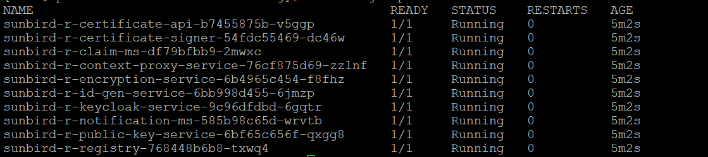
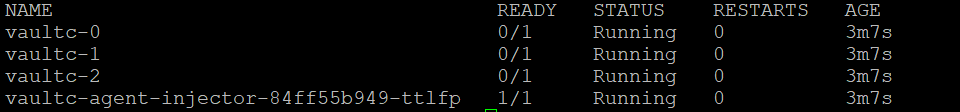
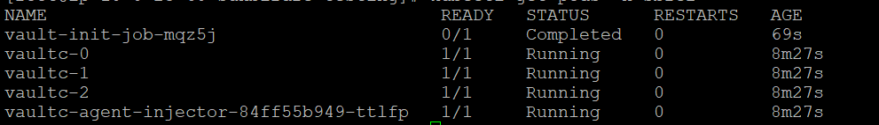
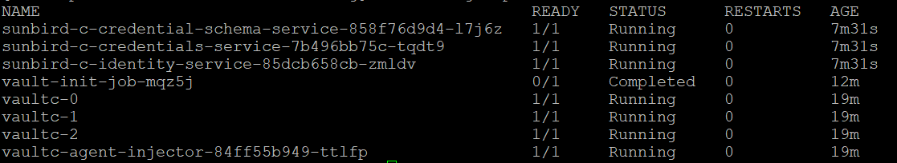
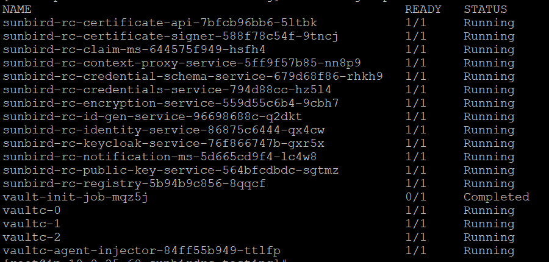

# Sunbird RC Services Helm Chart

This Helm chart provides a convenient way to deploy the Sunbird RC services, which includes various microservices and components. 

# Prerequisites

Before deploying this Helm chart, ensure you have the following prerequisites in place:

1. [Git](https://git-scm.com/)
2. [PostgreSQL](https://www.postgresql.org/) (installed on your local machine or remote server with access to local machine)
3. [Helm](https://helm.sh/) (installed on your local machine)
4. [Kubectl](https://kubernetes.io/docs/tasks/tools/install-kubectl/) (installed on your local machine)
5. Access to a Kubernetes cluster

## Deploying Sunbird RC – REGISTRY

Sunbird RC - REGISTRY deploys only registry microservices.

#### 1. Initialized Sunbird RC Helm Repository

```
helm repo add sunbird-rc2  https://dpgonaws.github.io/dpg-helm
```

#### 2. Check the Helm Repo Status:
```
helm repo list
```

#### 3. Search for Sunbrird RC Chart in Helm Repo:
```
helm search repo sunbird-rc2
```

```
NAME                                CHART VERSION   APP VERSION  DESCRIPTION
sunbird-rc2/sunbird-c-charts         0.0.1           0.0.13       A Helm chart for Sunbird RC
sunbird-rc2/sunbird-r-charts         0.0.1           0.0.13       A Helm chart for Sunbird RC
sunbird-rc2/sunbird_rc_charts        0.0.1           0.0.13       A Helm chart for Sunbird RC
sunbird-rc2/vault-init               0.1.0           1.16.0       A Helm chart for Kubernetes
```

#### 4. Helm Chart Sunbird RC Framework Deployment requires following User Inputs:
   
   #### Helm global deployment properties:  
    
   | Secret Key                                     | Value   | Description                         |
   | ---------------------------------------------  | ------- | ----------------------------------- |
   | global.database.host                            | XXXXYY  | RDS/Data Host Address               |
   | global.database.user                            | XXXXYY  | RDS/Data Username                   |
   | global.registry.database                        | XXXXYY  | RDS/Data Database                   |
   | global.registry.signature_provider              | XXXXYY  | dev.sunbirdrc.registry.service.impl.SignatureV1ServiceImpl                   |   
   | global.secrets.DB_PASSWORD                     | XXXXYY  | Database Password in Base64 encoded format                 |  
   | global.secrets.DB_URL                          | XXXXYY  | postgres://${rdsuser}:${RDS_PASSWORD}@${rdsHost}:5432/${credentialDBName} in Base64 encoded  format         |

   
#### 5. Install or Upgrade the Sunbird RC Framework via Helm Chart:
```
helm upgrade --install <release_name> sunbird-r-charts/ -n <namespace> --create-namespace  \
--set global.database.host="XXXXYY" \
 --set global.database.user="XXXXYY" \
 --set global.registry.database="XXXXYY" \
 --set global.registry.signature_provider="dev.sunbirdrc.registry.service.impl.SignatureV1ServiceImpl" \
 --set global.secrets.DB_PASSWORD="XXXXYY" \
 --set global.secrets.DB_URL="XXXXYY"
```
Replace `<release_name>` with a name for your release.

#### 6. Monitor the deployment status using the following command:
```
watch -n .5 kubectl get pods -n <namespace>
```


#### 7. After deployment, access the services and components as required.
```bash
kubectl get pods
kubectl get deploy
kubectl get svc 
helm list
```

## Deploying Sunbird RC - CREDENTIALING
Sunbird RC - CREDENTIALING deploys only credentialing microservices.

#### 1. Install vault from HashiCorp

Create a file named helm-vault-raft-values.yml and copy below content.

```
global:
  enabled: true
  namespace: "sbrc2-c"
server:
  affinity: ""
  ha:
    enabled: true
    raft:
      enabled: true
      setNodeId: true
      config: |
        cluster_name = "vault-integrated-storage"
        storage "raft" {
            path    = "/vault/data/"
        }
        listener "tcp" {
           address = "[::]:8200"
           cluster_address = "[::]:8201"
           tls_disable = "true"
        }
        service_registration "kubernetes" {}
```

```
helm install <vault_release_name> HashiCorp/vault \
--version 0.24.0 \
--values helm-vault-raft-values.yml \
-n <namespace> --create-namespace
```

```
helm status <vault_release_name>  -n <namespace>
```

Wait until all vault pods are in Running state. Vault pods will not be in ready state until it is initialized and unsealed.


#### 2. Initialize vault using vault-init chart

```
helm pull sunbird-rc2/vault-init --untar --destination .
```

```
helm upgrade --install <vault_init_release_name> vault-init/ -n <namespace> \
--set envVars.NAMESPACE="<namespace>" \
--set envVars.VAULT_NAME="<vault_release_name>"
```

Ensure all vault pods are in Ready state. Init will takes 1-2 minutes to  make vault pods are in ready state



#### 3. Helm global deployment properites:  
    
   | Secret Key                                     | Value   | Description                         |
   | ---------------------------------------------  | ------- | ----------------------------------- |
   | global.database.host                            | XXXXYY  | RDS/Data Host Address               |
   | global.database.user                            | XXXXYY  | RDS/Data Username                   |
   | global.registry.database                        | XXXXYY  | RDS/Data Database                   |
   | global.registry.signature_provider              | XXXXYY  | when the module choice is **R** the value is dev.sunbirdrc.registry.service.impl.SignatureV1ServiceImpl and when the module choice is **C** or **RC**, then the value is  dev.sunbirdrc.registry.service.impl.SignatureV2ServiceImpl            |   
   | global.secrets.DB_PASSWORD                     | XXXXYY  | Database Password in Base64 encoded format                 |  
   | global.secrets.DB_URL                          | XXXXYY  | postgres://${rdsuser}:${RDS_PASSWORD}@${rdsHost}:5432/${credentialDBName} in Base64 encoded  format         |
   | global.vault.address                            | XXXXYY  | http://<vault_release_name>:8200   |
   | global.vault.base_url                           | XXXXYY |http://<vault_release_name>:8200/v1     |
   | global.vault.root_path                          | XXXXYY  |http://<vault_release_name>:8200/v1/kv  |


#### 4. Deploy Credential app

```
helm upgrade --install <release_name> sunbird-c-charts/ -n <namespace> --create-namespace  \
--set global.database.host="<YOUR_DB_HOST_ADDRESS>" \
 --set global.database.user="postgres" \
 --set global.registry.database="registry" \
 --set global.registry.signature_provider="dev.sunbirdrc.registry.service.impl.SignatureV2ServiceImpl" \
 --set global.secrets.DB_PASSWORD="TkxoTCpJLWU1NGU=" \
 --set global.secrets.DB_URL="cG9zdGdyZXM6Ly9wb3N0Z3JlczpOTGhMKkktZTU0ZUByZHNzdGFja3NicmMyLWRhdGFiYXNlYjI2OWQ4YmItYjkyanl5bXdhdzZoLmNsdXN0ZXItY3Zla2xpdDJyajRtLmFwLXNvdXRoLTEucmRzLmFtYXpwewqdsavbmF3cy5jb206NTQzMi9zdW5iaXJ" \
 --set global.vault.address="http://<VAULT_RELEASE_NAME>:8200" \
 --set global.vault.base_url="http://<VAULT_RELEASE_NAME>:8200/v1" \
 --set global.vault.root_path="http://<VAULT_RELEASE_NAME>:8200/v1/kv" \

```

```
watch -n .5 kubectl get pods -n <namespace>
```


## Deploying Sunbird RC - REGISTRY_AND_CREDENTIALLING
Sunbird RC - REGISTRY_AND_CREDENTIALLING deploys both registry and credentialling microservices.

Execute [Install vault from HashiCorp](#1-install-vault-from-HashiCorp)  using new namespace

Execute [Initialize the vault using vault-init](#2-initialize-vault-using-vault-init-chart) 

```
helm pull sunbird-rc2/sunbird_rc_charts --untar --destination . 
```


```
helm upgrade --install <release_name> sunbird_rc_charts/ -n <namespace> --create-namespace  \
--set global.database.host="XXXXYY" \
 --set global.database.user="XXXXYY" \
 --set global.registry.database="XXXXYY" \
 --set global.registry.signature_provider="dev.sunbirdrc.registry.service.impl.SignatureV2ServiceImpl" \
 --set global.secrets.DB_PASSWORD="XXXXYY" \
 --set global.secrets.DB_URL="XXXXYY" \
 --set global.vault.address="XXXXYY" \
 --set global.vault.base_url="XXXXYY" \
 --set global.vault.root_path="XXXXYY" \
```


```
watch -n .5 kubectl get pods -n <namespace>
```




Follow the post installation steps to start using Sunbird RC2.0 services

* [Post Installation Procedure](03-Post-Installation-Procedure.md)

* NOTE:
If Vault becomes sealed, you have the option to unseal it using the unseal token stored in Kubernetes secrets.

```
kubectl get secrets vault-unseal-key -n <namespace>
```
Unseal the vault pods using below command.

```
kubectl exec <vault_pod_name> -n <namespace> -- vault operator unseal <vault_unseal_key>
```

**Lastly, if you wish to clean up, run below two commands to remove all resources that were created by you.**
```
helm uninstall <release_name> -n <namespace>

kubectl delete ns <namespace>
```