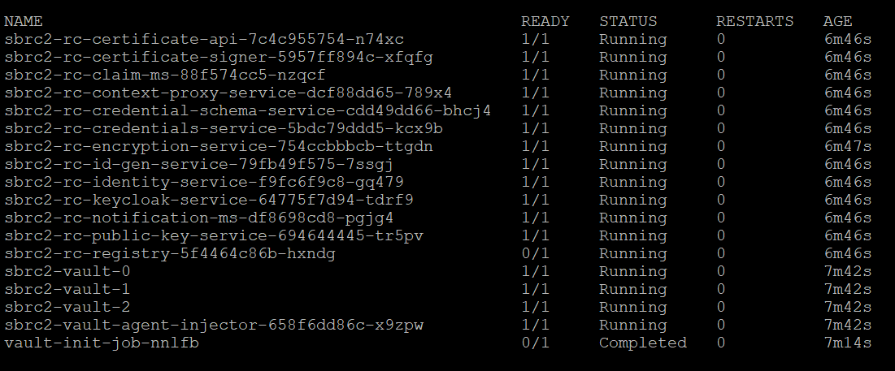
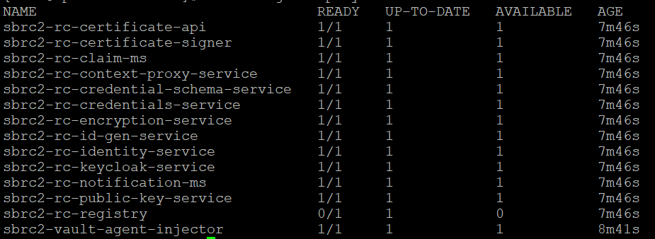
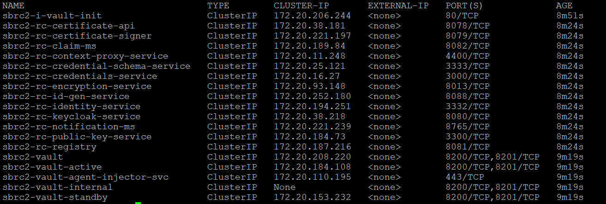
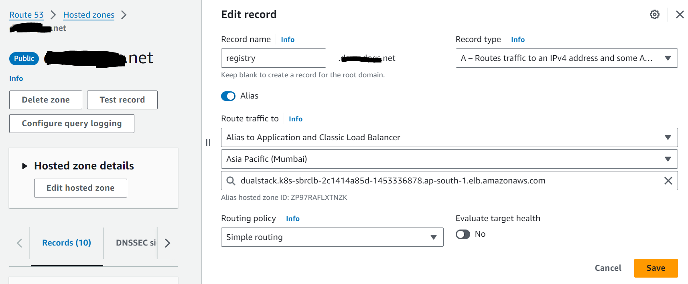
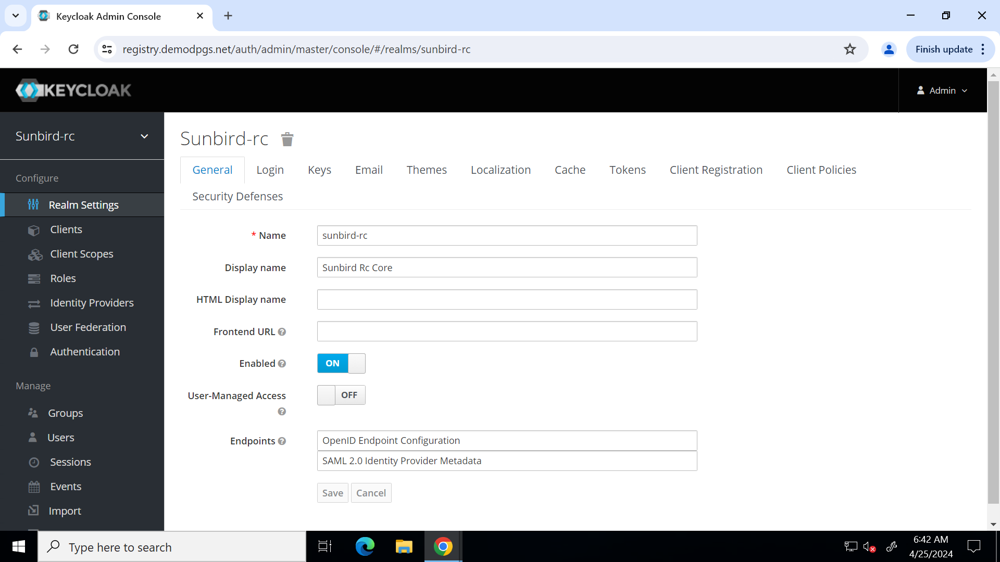
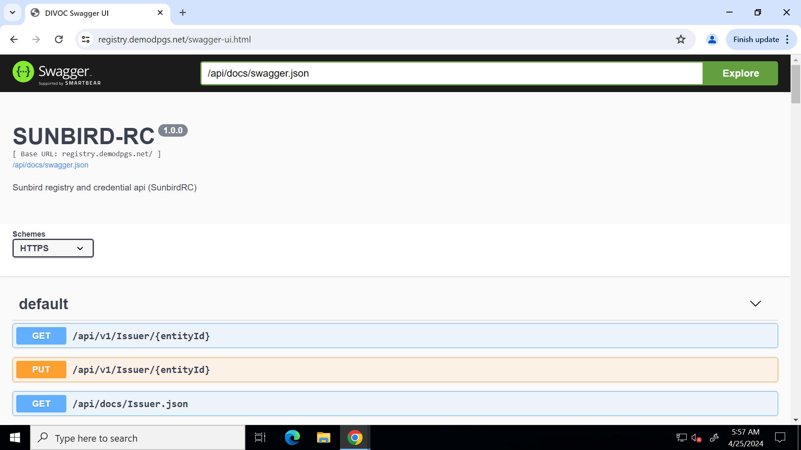

# Post Installation Steps

## Project Setup and Keycloak Configuration

This README provides instructions for verifying EKS cluster including pods, deployments and services. It also includes steps for configuring Keycloak after its installation and generating the admin client credentials to run registry service.

### 1. Check Pod and Service Status

Ensure all pods are running except registry pod and check the service status in your specified namespace.

```bash
kubectl get pods -n <namespace>
```


```
kubectl get deployments -n <namespace>
```

```
kubectl get svc -n <namespace>
```



### 2. Configure Keycloak service

The keycloak service will be available in  https://<SUNBIRD_RC2_HOSTNAME>/auth. Follow the below steps to complete the post installation setup.

1. [Import keycloak realm](https://github.com/Sunbird-RC/devops/tree/main/deploy-as-code/helm/v2/registryAndCredentialling#import-keycloak-realm)

2. [Configure keycloak secret](https://github.com/Sunbird-RC/devops/tree/main/deploy-as-code/helm/v2/registryAndCredentialling#configure-keycloak-secret)

### 3. Configure Domain for Sunbird RC hostname

You can use any domain services to get the host name for Sunbird RC. Here, we are going to see how the hostname is configured using Amazon Route53.

1. Get loadbalancer name from the deployed service by executing the below command. Copy the ALB DNS name from the results.

```
kubectl get ingress -n <namespace>
```

2. Go to Amazon Route53. Ensure, domain is already procured and hosted zone is created in Route53. Edit the **A** record by configuring the ALB DNS name.



### Configuration Complete
Once you've these steps, your Keycloak instance is configured as required. Ensure that the URLs and settings match your specific deployment and use case. Enjoy using Keycloak for your project and begin using Sunbird RC 2.0 Swagger UI.

- Keycloak portal will be accessible at https://<SUNBIRD_RC2_HOSTNAME>/auth


- Sunbird RC 2.0 registry API portal will be accessible at https://<SUNBIRD_RC2_HOSTNAME>/swagger-ui.html
